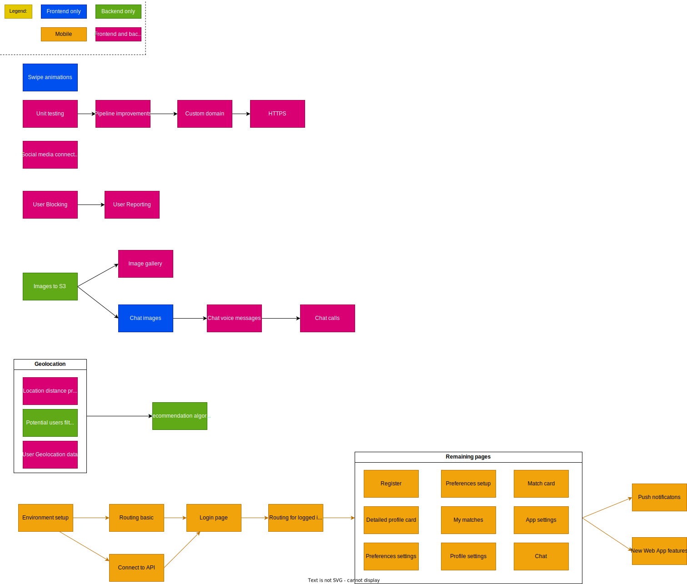
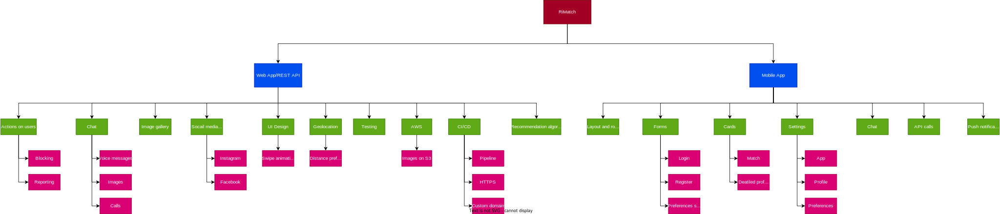

<a name="readme-top"></a>

<!-- PROJECT LOGO -->
<br />
<div align="center">
  <a href="https://github.com/RitehWebTeam/infobip-rimatch">
    
  </a>

<h3 align="center">RiMatch</h3>

  <p align="center">
    RiMatch is a dating application which helps users find connections by creating profiles, matching them with others based on preferences, and enabling communication through chat. 
    <br />
    <br />
    <a href="http://rimatch-app.s3-website.eu-central-1.amazonaws.com">View Demo</a>
    ·
    <a href="https://github.com/RitehWebTeam/infobip-rimatch/issues">Report Bug</a>
    ·
    <a href="https://github.com/RitehWebTeam/infobip-rimatch/issues">Request Feature</a>
  </p>
</div>

<!-- TABLE OF CONTENTS -->
<details>
  <summary>Table of Contents</summary>
  <ol>
    <li>
      <a href="#about-the-project">About The Project</a>
      <ul>
				<li><a href="#features">Features</a></li>
        <li><a href="#built-with">Built With</a></li>
      </ul>
    </li>
    <li>
      <a href="#getting-started">Getting Started</a>
      <ul>
        <li><a href="#prerequisites">Prerequisites</a></li>
        <li><a href="#installation">Installation</a></li>
      </ul>
    </li>
    <li><a href="#roadmap">Roadmap</a></li>
  </ol>
</details>

<!-- ABOUT THE PROJECT -->

## About The Project

[![Product Name Screen Shot][product-screenshot]](https://example.com)

Looking to expand your social circle? RiMatch takes the legwork out of meeting new people. Create a detailed profile highlighting your interests, and our smart algorithm will connect you with compatible matches based on your preferences, including location if you choose. Chat with your matches through text, images, or even voice messages, and see if a spark ignites! The experience is seamless on both web and mobile (iOS and Android) with a user-friendly interface and features like swipe gestures for easy interaction.

### Features:

- User Profile Creation:
  - During registration, users enter their name, gender, date of birth, email address, and password.
  - After successful first login, users specify their preferences including desired partner gender, age range, a description of themselves, and a profile picture.
- Messaging:
  - After a successful match the users can receive SMS or email notifications
- Matching Users:
  - An algorithm recommends potential partners based on user preferences.
  - When shown a potential partner, users can view their full profile by clicking a "details" button.
  - Users indicate interest in a partner by clicking "like" or skip them by clicking "skip."
- Profile Editing:
  - Users can edit their profile information at any time.
  - This includes changing their preferences and updating their profile pictures.
- Authentication:
  - The application uses JWT tokens for authentication.

### Built With

#### Frontend:

[![React][React.js]][React-url]
[![TypeScript][TypeScript]][TypeScript-url]
[![TailwindCSS][tailwindcss]][tailwindcss-url]

#### Backend:

[![Spring boot][Springboot]][Springboot-url]
[![Maven][maven]][maven-url]
[![MongoDB][mongodb]][mongodb-url]

#### Other:

[![Docker][docker]][docker-url]

<p align="right">(<a href="#readme-top">back to top</a>)</p>

<!-- GETTING STARTED -->

## Getting Started

The simplest way to start the app is using [Docker][docker-url] so make sure you have it installed and running.

### Prerequisites

- Docker installed and running
- `secrets.properties` file added to the root of the backend folder  
  _Example `secrets.properties`:_

  ```
  spring.data.mongodb.uri=db_url_goes_here

  jwt.secret.access=32_char_secret_here
  jwt.secret.refresh=32_char_secret_here

  infobip.api-key=infobip_api_key_here
  infobip.base-url=infobip_base_url
  infobip.sender-email=email@test.com
  infobip.phone-number=123456789
  ```

### Installation

1. Clone the repo
   ```sh
   git clone https://github.com/RitehWebTeam/infobip-rimatch.git
   ```
2. Install NPM packages
   ```sh
   docker compose up --build
   ```

<p align="right">(<a href="#readme-top">back to top</a>)</p>

<!-- ROADMAP -->

## Roadmap

<details>
<summary>PERT and WBS charts</summary>
<h3>PERT</h3>

<hr>
<h3>WBS</h3>

<hr>
</details>
<br/>

- [ ] Blocking users
- [ ] Reporting users
- [ ] Saving images to S3
- [ ] Image gallery
- [ ] Design improvements
- [ ] Improved recommendation algorithm
  - [ ] Geolocation
  - [ ] Remembering users' choices
- [ ] React Native mobile app

See the [open issues](https://github.com/RitehWebTeam/infobip-rimatch/issues) for a full list of proposed features (and known issues).

<p align="right">(<a href="#readme-top">back to top</a>)</p>

<!-- MARKDOWN LINKS & IMAGES -->
<!-- https://www.markdownguide.org/basic-syntax/#reference-style-links -->

[product-screenshot]: images/rimatch-app.png
[React.js]: https://img.shields.io/badge/React-20232A?style=for-the-badge&logo=react&logoColor=61DAFB
[React-url]: https://reactjs.org/
[TypeScript]: https://img.shields.io/badge/TypeScript-3178C6?style=for-the-badge&logo=typescript&logoColor=white
[TypeScript-url]: https://www.typescriptlang.org/
[SpringBoot]: https://img.shields.io/badge/springboot-6DB33F?style=for-the-badge&logo=springboot&logoColor=white
[SpringBoot-url]: https://spring.io/projects/spring-boot
[tailwindcss]: https://img.shields.io/badge/tailwindcss-06B6D4?style=for-the-badge&logo=tailwindcss&logoColor=white
[tailwindcss-url]: https://tailwindcss.com/
[mongodb]: https://img.shields.io/badge/mongodb-47A248?style=for-the-badge&logo=mongodb&logoColor=white
[mongodb-url]: https://www.mongodb.com/
[maven]: https://img.shields.io/badge/maven-%23C71A36?style=for-the-badge&logo=apachemaven&logoColor=white
[maven-url]: https://maven.apache.org/
[docker]: https://img.shields.io/badge/docker-%232496ED?style=for-the-badge&logo=docker&logoColor=white
[docker-url]: https://www.docker.com/
[pert-chart]: docs/RiMatch_Charts.drawio.svg
